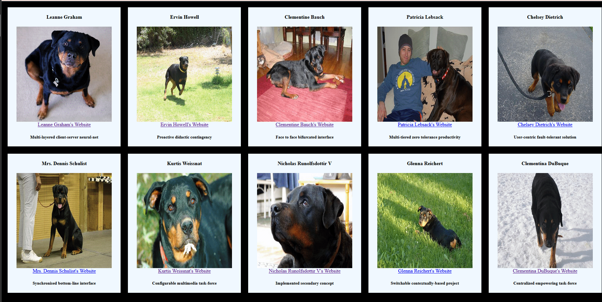
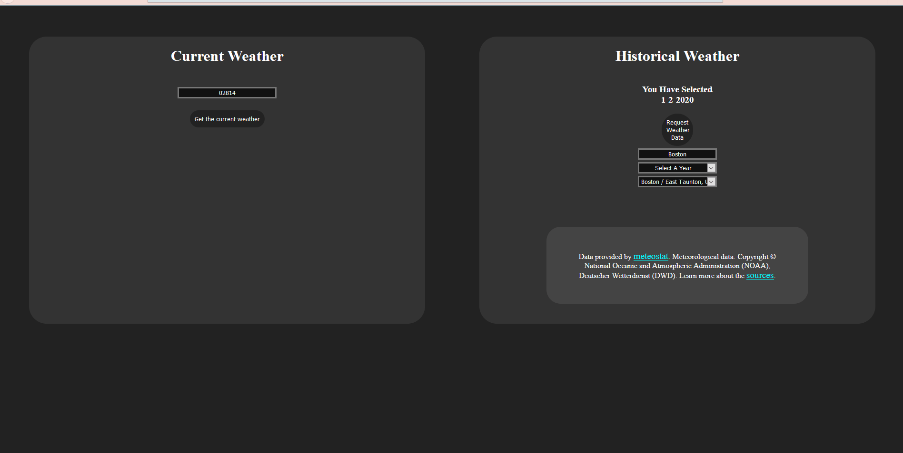

# NASA APOD API

    This API allows request with a 'date' query parameter from Jun 16th 1995 to the current date. Two versions of frontend implementations of this API can be viewed below. The distinct diffrent between the two is how the user selects a date. Version two date selection is more complex.

### NASA - Version One

 

### NASA - Version Two

 

# Git Users API
    this is the most fleshed out api project to date, it will do a very similar funcition to the rest but the display in the browser look better than rest. Using css grid users are displayed on a full page where each user has its own div of elements. When the button in a div is pressed a more detailed list of information the user appears in thier div

 ### Example of Git Users API:

 

# JSON-PlaceHolder and Dog.ceo APIs
    an api calling program that calls two apis and creates a frontend display using data received from both Api responses. the jsonplaceholder website is used to get fake user info, and dog.ceo's api is used to get random pictures of dogs to display with the fake user information. The front end uses CSS grid to shows a neat display of the infromation received from the API requests 

 ### Example of JSON-PlaceHolder and Dog.ceo APIs:

 

# Two APIs Project 

    a program that displays a White Pages style information page with dog pictures as the peoples images. Fake person information comes from the api:
    https://jsonplaceholder.typicode.com/users
    and the api for the dog images is:
    https://dog.ceo/api/breed/rottweiler/images/random

    once all the pictures have been requested from dog.ceo the request for the fake person info is made

    this project was made to demo async code and how http request rely on async opertaions to deliver infomation to the client-side with long wait times.

 ### Example of Two APIs Project:

 

# Weather APIs

## Open Weather API

    Devs can only get free access to current weather reports

### Example Open Weather API:

## MeteoStat API

    Gives deveoplers access to weathers stations all around the world with historical weather data

### Example MeteoStat And OpenWeather API:

#### MeteoStat right, OpenWeather left

SINGLE FILE PROJECTS
    simpleXHRequest.html - access the JSONPlaceholder API to get an array of objects, each object containing a user's infomation. This infomation is then added to the DOM with heading and link elements.

    xhrdemo.html - accessing the github api to get a list of users and then create a list using their login names. A paragraph element is used to string the users information one after another with < br > tags to make each username appear on a new line 

    firstxhr.html - working with peers to create a new xhr demo file, using the github api an array of objects is requested when the page loads. Each user will have its properties displayed to the frontend, a button will also be added for each user to request more detailed information. This file shows api calls with a static endpoint and api calls with request parameters